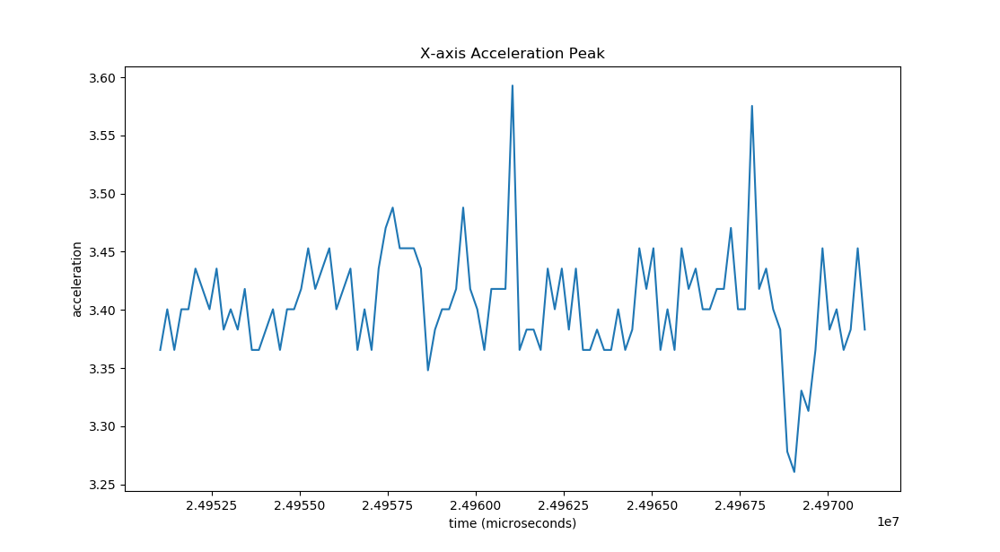

Example Script: Plot Peak
=========================

This script takes a given accelerometer subchannel, and plots a +-10ms window of samples around the waveform's maximum value.

.. literalinclude:: ../enDAQ-Lab-scripts/scripts/peak_plot.py
   :language: python2

:download:`Download script <../enDAQ-Lab-scripts/scripts/peak_plot.py>`.
