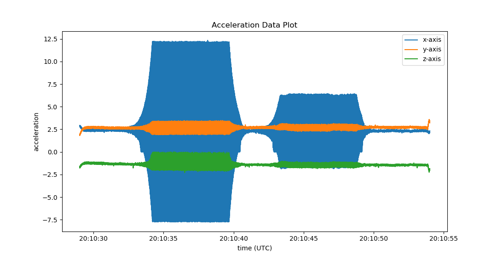

Example Script: Generating a plot
=================================

This is a script to:

- take the acceleration channel from an IDE file,
- pull out all samples and respective timestamps, and
- make a simple matplotlib plot of the data.

It exemplifies some of the basic concepts for interpreting data from an IDE file.

.. literalinclude:: ../enDAQ-Lab-scripts/scripts/simple_plot_accel.py
   :language: python2

:download:`Download script <../enDAQ-Lab-scripts/scripts/simple_plot_accel.py>`.
