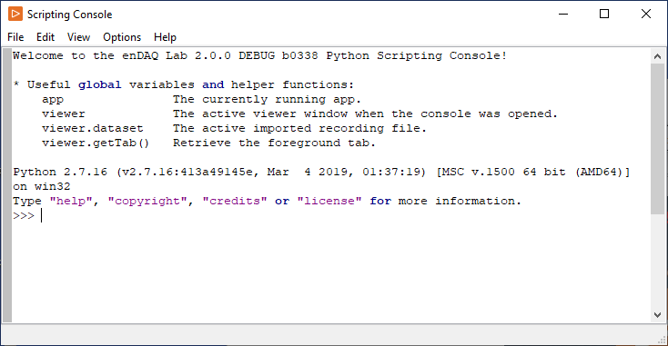
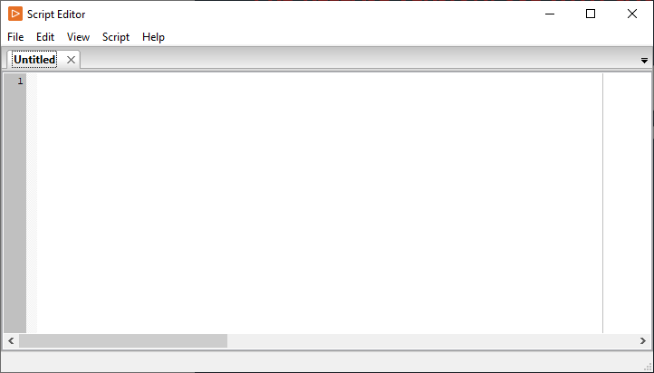

Scripting Tools
===============

As of enDAQ Lab 2.0, Lab now provides the Scripting menu which enables users to programmatically interact in Python with many of the components of enDAQ Lab. This page aims to familiarize you with the various features that the Scripting menu offers.

Enabling the Scripting menu
---------------------------

Scripting is disabled and hidden by default. To use it, it must first be enabled in the Preferences:

- In the main window’s menu bar, select `Edit → Preferences` to bring up the preferences dialog
- In the dialog, find the item `Enable Scripting` and check it
- Click `Save` to save the change and close the dialog
- You should now have a `Scripting` menu in the menu bar of the main window

The Python Console
------------------

The Scripting menu makes available a *Python Console*, where users can dynamically interact with the enDAQ Lab application. This is a great tool to use if you want to investigate your data, test out an experimental idea, or just want to explore enDAQ Lab's Python API.

To open the Python Console:

- In the main window’s menu bar, select `Scripting → Open Python Console`
- The Python Console should open in a new window

How the Console Works
^^^^^^^^^^^^^^^^^^^^^

The Python Console in enDAQ Lab is effectively the same as the python console you might open from your machine's command line; for example, you can execute a "hello world" command just as you would in a normal Python console:

>>> print "hello world"
hello world

However, there are a couple of things that should be noted about how the enDAQ Lab Python Console works:

- The console uses Python 2.7, which differs from Python 3.x in a number of ways. If some of your code doesn't work as expected, make sure it's Python 2 compatible!
- Each console window's run environment is based on *the main view from which the console was generated* (the "root" view). This has some implications:
  - For example, variables defined in a console that was opened from one view will *not* be accessible from a console opened from another view.
  - The ``viewer`` object in the console's global variables (discussed in :ref:`viewer_obj`) belongs to the root view; if multiple views are open, the console will only have access to data and variables loaded in its root view.

Extra Features
^^^^^^^^^^^^^^

The main advantage of the enDAQ Lab Python Console is its access to the enDAQ Lab Python API; specifically, the enDAQ Lab Python Console automatically includes global variables and package imports specific to the API. For more information on these global variables & packages, see :ref:`global_vars`, or select `Help → Help` from the Python Console's menu bar for a brief reference to these variables.

In addition to the funtionality of a typical Python console, there are a number of subtle text editor features (especially of interest to "power users") that can be toggled through the menu bar. To those doing extensive work in the console, we recommend reading the content located in `Help → Help` for a list of useful keyboard shortcuts.

The Script Editor
-----------------

The *Script Editor* is a text editor for writing Python scripts to run in enDAQ Lab's Python environment. This is a great tool to use if you want to execute a longer set of instructions at once, or make a set of instructions that you can reuse in the future.

To open the Script Editor, go to the main window’s menu bar and select `Scripting → Open Script Editor`. From this window, you can perform many of the common text editor functionalities, like opening/saving files, find and replace, etc., through the `File` and `Edit` menu items.

For some example scripts to get started, see :ref:`eg_scripts`.

Once you have a complete script, you can run your code by clicking `Script → Run Script`. This will run your code in the Python Console, where you can view any outputs or errors. Similarly to the Python Console, the run environment for the Script Editor is based on *the main view from which the console was generated*.
